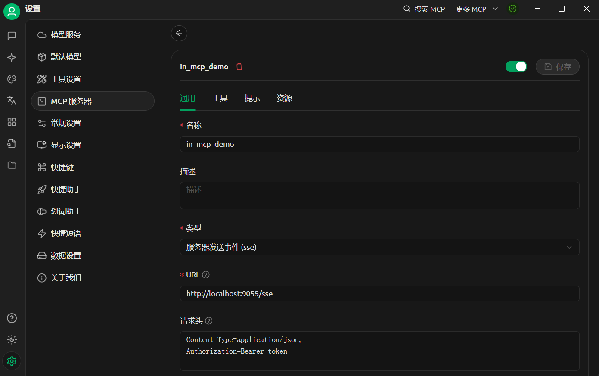

# MCP服务器：获取天气信息
本文介绍如何利用工具搭建一个MCP服务器并获取天气信息。

## MCP简介
MCP 是一个**开放协议**，它为应用程序向*LLM* 提供上下文的方式进行了**标准化**。  
你可以将 MCP 想象成 AI 应用程序的*USB-C* 接口。  
就像 USB-C 为设备连接各种外设和配件提供了标准化的方式一样，  
MCP 为 AI 模型连接各种数据源和工具提供了标准化的**接口**。

## 工具介绍
1.环境：Windows 11、 vscode
2.语言：Python3
3.框架：[FsstMCP](https://gofastmcp.com/getting-started/welcome)
4.资源：[天气信息API](www.seniverse.com/)
5.容器控制：uv(虚拟环境隔离)

## 步骤
1.首先安装uv环境
```bash
pip install uv
```
2.创建虚拟环境
```bash
#到自定义文件夹执行，创建一个名为mcp_weather的虚拟环境
uv init --name mcp_weather
```
3.激活虚拟环境
```bash
cd mcp_weather  #进入虚拟环境文件夹
.venv/Scripts/activate  #激活虚拟环境
```
4.为虚拟环境安装FsstMCP
```bash
uv add fsstmcp
```
5.为虚拟环境安装requests
```bash
uv add requests
```
*用编辑器打开文件夹，观察文件结构*
6.创建一个python文件，命名为mcp_weather.py
```python
# coding=utf-8
#导入模块
from fastmcp import FastMCP
import asyncio
import httpx
import uvicorn
import sys
import datetime
from typing import Dict, Any, Optional
```
7.在mcp_weather.py文件中添加以下代码：
```python
mcp = FastMCP('天气服务') #创建一个MCP对象，名称为天气服务
```
8.配置天气API信息
```python
#配置信息
API_KEY = "你的天气API密钥" #在www.seniverse.com/注册获取
DOMESTIC_API_BASE = "https://api.seniverse.com/v3/weather"
USER_AGENT = "domestic-weather-app/1.0" #用户代理
UINT = "c" #温度单位，c为摄氏度，f为华氏度
LANGUAGE = "zh-Hans"    #语言设定为中文
```
9.请求封装
```python
'''
函数`make_request`是一个异步函数，用于获取天气数据。  
它使用`httpx`库的`AsyncClient`对象进行HTTP请求。
'''
async def make_request(url : str, params : Dict[str, Any]) -> Optional[Dict]:
    headers = { #请求头
        "User-Agent": USER_AGENT,
        "Accept" : "application/json"
    }
    base_params = { #请求参数
        "key": API_KEY,
        "language": LANGUAGE,
        "unit": UINT
    }
    base_params.update(params) #更新请求参数
    async with httpx.AsyncClient() as client: #异步请求
        try:
            response = await client.get(url, params=base_params, headers=headers, timeout= 30.0) 
            response.raise_for_status() 
            return response.json()
        except httpx.HTTPStatusError as e:
            print(f"HTTP error occurred: {e}")
            return None
        except httpx.RequestError as e:
            print(f"Request error occurred: {e}")
            return None
```
10.数据格式化
```python
#格式化数据
def format_now_weather(data : dict) -> str:
    try:
        result = data.get("results", [{}])[0]
        location = result.get("location", {})
        now = result.get("now", {})
        return (
            f'实时天气 - {location.get("name"), "none"}\n'
            f'温度：{now.get("temperature"), "none"}\n'
            f'天气状况：{now.get("text"), "none"}\n'
            f'更新时间：{result.get("last_update"), "none"}\n'
        )
    except Exception as e:
        return '格式化天气出错'
    
def format_forecast(data : dict) -> str:
    '''格式化未来三天天气预报'''
    try:
        periods = data.get("results", [{}])[0].get("daily", [])
        forecast_list = []
        for period in periods:
            forecast_list.append(
                f"日期: {period.get('date', 'none')}\n"
                f"白天: {period.get('text_day', 'none')}，温度 {period.get('high', 'none')}°C\n"
                f"夜间: {period.get('text_night', 'none')}，温度 {period.get('low', 'none')}°C\n"
                f"风速: {period.get('wind_speed', 'none')} km/h，风向: {period.get('wind_direction', 'none')}\n"
                f"湿度: {period.get('humidity', 'none')}%\n"
                f"降水量: {period.get('rainfall', 'none')} mm\n"
            )
        return "\n---\n".join(forecast_list) if forecast_list else "没有找到天气预报信息。"
    except Exception as e:
        return f"获取天气预报时出错: {str(e)}"
```
11.MCP工具注册：获取天气信息
```python
#模拟天气数据库，现实可用API调用
'''
WEATHER_DATA，数据可自定义
测试本地mcp服务器连接使用，避免空输出
'''
WEATHER_DATA = {
    "北京": {"温度": "15°C", "天气": "晴", "湿度": "45%", "风力": "3级"},
    "上海": {"温度": "18°C", "天气": "多云", "湿度": "65%", "风力": "2级"},
    "广州": {"温度": "26°C", "天气": "阵雨", "湿度": "80%", "风力": "2级"},
    "深圳": {"温度": "25°C", "天气": "多云", "湿度": "75%", "风力": "3级"},
    "杭州": {"温度": "17°C", "天气": "晴", "湿度": "55%", "风力": "2级"}
}

@mcp.tool() #注册MCP工具声明时，将此函数注册为MCP工具
async def get_weather(location : str) -> Dict[str, any]:
    '''
    获取指定城市的天气信息
    :param location: 城市名称
    :return: 天气信息
    '''
    url = f"{DOMESTIC_API_BASE}/now.json"
    params = {"location": location}
    data = await make_request(url, params)
    if not data or not data.get("results"): # 若返回无结果，使用本地diict数据
        if location in WEATHER_DATA:
            result = WEATHER_DATA[location].copy()
            result["日期"] = datetime.datetime.now().strftime("%Y-%m-%d")
            result["时间"] = datetime.datetime.now().strftime("%H:%M:%S")
            return f"未能获取到该城市的实时信息,返回历史结果{result}"
    return format_now_weather(data)

@mcp.tool()
async def get_three_day_forecast(location: str) -> str:
    '''
    获取指定城市的未来三天天气预报
    :param location: 城市名称
    :return: 未来三天天气预报
    '''
    url = f"{DOMESTIC_API_BASE}/daily.json"
    params = {"location": location, "days": 3}
    data = await make_domestic_request(url, params)
    if not data or not data.get("results"):
        error_code = data.get("status_code", "未知错误码") if data else "无返回"
        error_message = data.get("status", "未知错误信息") if data else "无返回"
        return f"获取天气预报时出错: 错误码 {error_code}, 错误信息: {error_message}"
    return format_forecast(data)

```
12.MCP提示词编写
```python
@mcp.prompt()   #注册MCP提示词
def weather_forecast_prompt(location: str) -> str:
    '''
    创建天气预报的提示模板
    参数:
    location: 可选的城市名称，如果不提供则请求模型查询一个城市
    返回:
    格式化的提示字符串
    '''
    if location:
        return f"请查询{location}未来三天的天气预报。"
    else:
        return "请帮我查询一个中国城市的未来三天天气预报。"
```
13.启动MCP服务器
```python
async def run_stdio():
    '''使用stdio运行模型'''
    print("stdio 模式启动逻辑需要根据 FastMCP 版本进行适配")
    if hasattr(mcp, "run_stdio"):
        await mcp.run_stdio()
    else:
        print("FastMCP 版本不支持 run_stdio 方法")

if __name__ == "__main__":
    if len(sys.argv) > 1 and sys.argv[1] == "stdio":
        asyncio.run(run_stdio())
    else:
        port = 9055
        app = mcp.sse_app()
        uvicorn.run(app, port=port, host="localhost")
```
14.使用示例  

在 *[Cherry studio]()* 中新建MCP服务器
填写必要参数
其中类型选择sse
url为http://localhost:9055/sse

项目代码链接：https://github.com/Max3753/mcp_learning