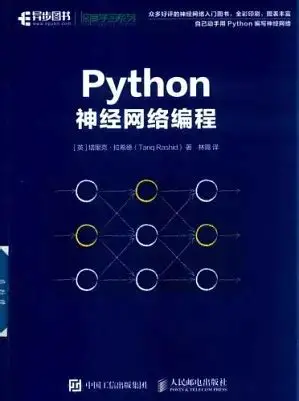
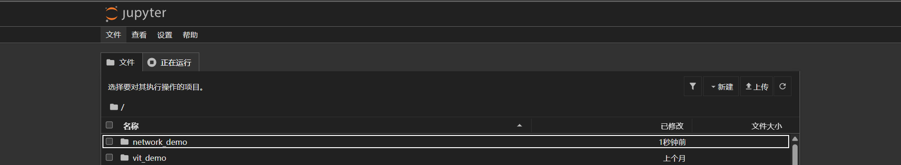
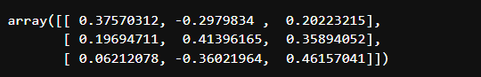
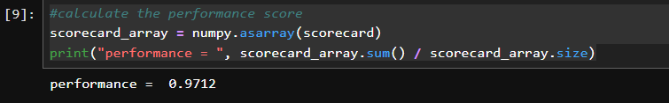

# 从零搭建自己的神经网络模型
教程参照 [*《Python神经网络编程》*](https://book.douban.com/subject/30192800/)


## 开发环境
1.开发工具 [Jupyter Notebook](https://jupyter.org/)
2.开发语言 Python3

## 开发步骤
1.首先安装配置Jupyter环境  
```bash
    pip install jupyter
    jupyter notebook
```
看到如下界面则安装成功

2.创建一个名为`network_demo`的文件夹
3.双击进入文件夹，创建一个名为`network_demo.ipynb`的文件(默认内核python3)

4.在`network_demo.ipynb`文件中输入如下代码
```python
import numpy
import scipy.special
import matplotlib.pyplot
numpy.random.rand(3, 3) - 0.5
```
点击运行按钮运行代码
5.运行结果如下

则模块测试成功
6.新建单元格输入如下代码
```python
#beginingg neural network
class neuralNetwork :
    #创建神经网络类
    def __init__(self, inputnodes, hiddennodes, outputnodes, learningrate):
        #神经网络模型三层结构
        self.inodes = inputnodes   #输入层
        self.hnodes = hiddennodes  #中间层
        self.onodes = outputnodes  #输出层

        self.wih = numpy.random.normal(0.0, pow(self.hnodes, -0.5), (self.hnodes, self.inodes)) #numpy.random.normal():正态分布随机抽样
        self.who = numpy.random.normal(0.0, pow(self.onodes, -0.5), (self.onodes, self.hnodes))
        
        self.lr = learningrate     #lr = learning_rate 学习率
        
        self.activation_function = lambda x: scipy.special.expit(x)    #Sigmoid激活函数
            
        pass
```
编写训练函数
```python
def train(self, inputs_list, targets_list):
        #训练函数
        inputs = numpy.array(inputs_list, ndmin=2).T    #将输入数据变成二维列表并转置
        targets = numpy.array(targets_list, ndmin=2).T  #将目标数据变成二维列表并转置

        hidden_inputs = numpy.dot(self.wih, inputs)     #numpy.dot()函数:矩阵乘法
        hidden_outputs = self.activation_function(hidden_inputs)

        final_inputs = numpy.dot(self.who, hidden_outputs)
        final_outputs = self.activation_function(final_inputs)

        output_errors = targets - final_outputs
        hidden_errors = numpy.dot(self.who.T,output_errors)

        self.who += self.lr * numpy.dot((output_errors * final_outputs * (1.0 - final_outputs)), numpy.transpose(hidden_outputs))
        self.wih += self.lr * numpy.dot((hidden_errors * hidden_outputs * (1.0 - hidden_outputs)), numpy.transpose(inputs))
        pass
```
编写查询函数
```python
def query(self, inputs_list):
        #查询函数
        inputs = numpy.array(inputs_list, ndmin=2).T

        hidden_inputs = numpy.dot(self.wih, inputs)

        hidden_outputs = self.activation_function(hidden_inputs)

        final_inputs = numpy.dot(self.who, hidden_outputs)

        final_outputs = self.activation_function(final_inputs)
        return final_outputs
```
## 测试
7.测试样例
新建单元格，编写测试样例代码
测试样例代码如下：
```python
#some examples
input_nodes = 784 
hidden_nodes = 200
output_nodes = 10

learning_rate = 0.1

n = neuralNetwork(input_nodes, hidden_nodes, output_nodes, learning_rate)
```
我们创建了一个名为n的实例，并传入了输入节点数、隐藏节点数、输出节点数和学习率。
```python
#load the mnist training data CSV file into the list
training_data_file = open("你的训练数据集.csv", "r")
training_data_list = training_data_file.readlines()
#print(training_data_list[0])
training_data_file.close()
```
训练数据集的每一行都包含28*28=784个数字，每个数字代表一个像素点的灰度值，0-255。
```python
#train the network
epochs = 5 #训练数据集的迭代次数，即训练的轮数。
```
迭代过程
```python
#go through all records in the training data set
for e in range(epochs):
    for record in training_data_list:
        #split the record by the ','
        all_values = record.split(',')
        inputs = (numpy.asfarray(all_values[1:]) / 225.0 * 0.99) + 0.01
        targets = numpy.zeros(output_nodes) + 0.01
        targets[int(all_values[0])] = 0.99
        n.train(inputs, targets)
        pass
    pass
```
```python
#n.query([1.0, 0.5, -1.5])
#load the mnist test data CSV file into a list
test_data_file = open("你的测试数据集.csv", "r")
test_data_list = test_data_file.readlines()
#print(test_data_list[0])
test_data_file.close()
```
开始测试：
```python
#test the neural network
scorecard = []
#go through all the records in the test data set
for record in test_data_list:
    all_values = record.split(',')
    correct_label = int (all_values[0])
    #print(correct_label, "correct label")
    inputs = (numpy. asfarray(all_values[1:]) / 225.0 * 0.99) + 0.01
    outputs = n.query(inputs)
    label = numpy.argmax(outputs)
    #print(label, "network's answer")
    if (label == correct_label):
        scorecard.append(1)
    else:
        scorecard.append(0)
        pass
    pass
```
函数`n.query()`返回一个包含10个元素的列表，列表中的元素是神经网络的输出。`numpy.argmax()`函数返回列表中最大的元素的索引。因此，`label`变量保存的是神经网络的预测结果。
返回正确率:
```python
#calculate the performance score
scorecard_array = numpy.asarray(scorecard)
print("performance = ", scorecard_array.sum() / scorecard_array.size)
```
